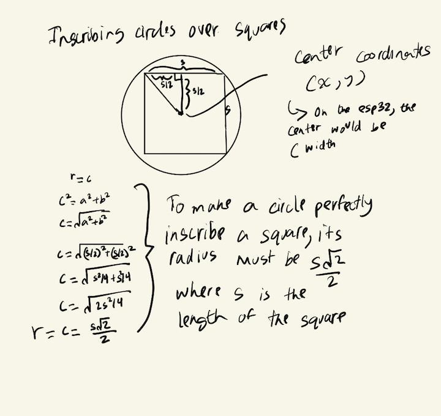

# Inscribed-Concentric-Shapes

Uses the TFT_eSPI library to displays concentric squares and circles inscribed almost perfectly on top of one another with color transitions resembling that of fall leaves.

## Blog Post

You can take an in depth look at my process making this program in this [blog post](TBD).

## Table of Contents

- [Features and Tools](#features-and-tools)
- [How to Build the Project](#how-to-build-the-project)
- [Design Process](#design-process)
- [Demos](#demos)
- [Contributors](#contributors)

## Features and Tools

- [Arduino IDE](https://support.arduino.cc/hc/en-us/articles/360019833020-Download-and-install-Arduino-IDE)
- [Lilygo TTGO ESP32](https://www.amazon.com/LILYGO-T-Display-Arduino-Development-CH9102F/dp/B099MPFJ9M?th=1)
- Envelope or equivalent foldable cardboard object
- Tape
- Thread strings
- USB-C
- [1000 mAh Lithium Rechargeable Battery](https://www.amazon.com/MakerFocus-Rechargable-Protection-Insulated-Development/dp/B07CXNQ3ZR/ref=asc_df_B07CXNQ3ZR/?tag=hyprod-20&linkCode=df0&hvadid=693418895745&hvpos=&hvnetw=g&hvrand=9952653053733686756&hvpone=&hvptwo=&hvqmt=&hvdev=c&hvdvcmdl=&hvlocint=&hvlocphy=9003479&hvtargid=pla-570313739730&psc=1&mcid=17ac86c4b04d38eb95f2cb36df3604d9)

## How to Build the Project 

1. Clone the repository:

   ```bash
   git clone https://github.com/asder8215/Inscribed-Concentric-Shapes.git
   ```
2. From the src folder, import or move the `FallColorSwitchShapes.ino` into Arduino Folder
    * If Arduino IDE is not installed, look at this [Arduino Support Page](https://support.arduino.cc/hc/en-us/articles/360019833020-Download-and-install-Arduino-IDE) on how to install the Arduino IDE.

3. Follow these [installation steps](https://coms3930.notion.site/Lab-1-TFT-Display-a53b9c10137a4d95b22d301ec6009a94) to correctly set up the libraries needed to write and run code for TTGO ESP32

4. Once everything is set up, you can connect your ESP32 to your laptop or computer via USB-C and click on the `Upload` button on the top left of the Arduino IDE. This will make the code compile and store onto the ESP32.

5. After confirming that the code runs on your ESP32, you can start making your envelope and putting the ESP32 in the center. You can look at this [guide](https://coms3930.notion.site/Module-1-Install-10a350cc6f058045b899e7d3c2a3c8f5) to see how to attach the ESP32 and a battery to the envelope.

6. Lastly, feel free to put up your envelope held ESP32 with the inscribed shapes up somewhere!

## Design Process

These contain images and references on my process choosing the colors for the shape and the math behind how the shapes are inscribed on one another.

- Fall Color References:

- Circle and Square Inscribing



## Demos

- Prototype: 

- Envelope Showcase:

- Final Version:
    
    

## Contributors

- Mahdi Ali-Raihan